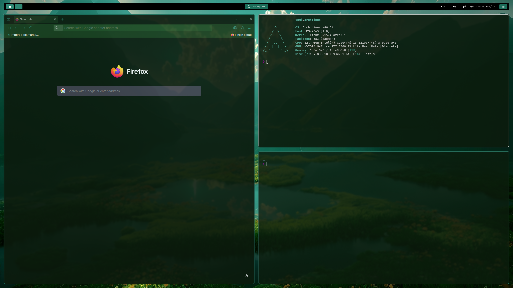

# dotfiles

My current arch linux setup. Feel free to suggest changes or reach out to me if you have any problems with it.

## Screenshots





## Setup

1. Install [Arch Linux](https://archlinux.org/download/)
2. After completing the installation with `archinstall`, reboot into the Linux
3. Clone this git repository (ssh setup)
4. Set up SSH:
    ```sh
    sudo pacman -S openssh git neovim
    ssh-keygen -t ed25519 -C "your_email@example.com"
    eval "$(ssh-agent -s)"
    ssh-add ~/.ssh/id_ed25519
    cat ~/.ssh/id_ed25519.pub
    ```
5. Copy the contents of the *~/.ssh/id_ed25519.pub* to the **SSH and GPG keys** in GitHub under Settings
6. `git clone git@github.com:imot9/dotfiles.git`~/dotfiles
7. `sh ~/dotfiles/setup.sh`, which will
	- install the necessary packages,
	- change shell from bash to zsh
	-  copy .desktop files from /usr/share/applications/ &rarr; ~/.local/share/applications/, and provide a selection for which apps to show in rofi
	- stow the dotfiles
	- provide a package cleanup
8. After the setup script finished,`reboot`
9. Hyprland should start immediately after logging in

### Problems with the setup
- The hyprlock and hyprland config contain hardcoded monitor setups. Edit them with `hyprctl monitors` accordingly.
- If you have an nvidia gpu, make sure to install the necessary drivers.


